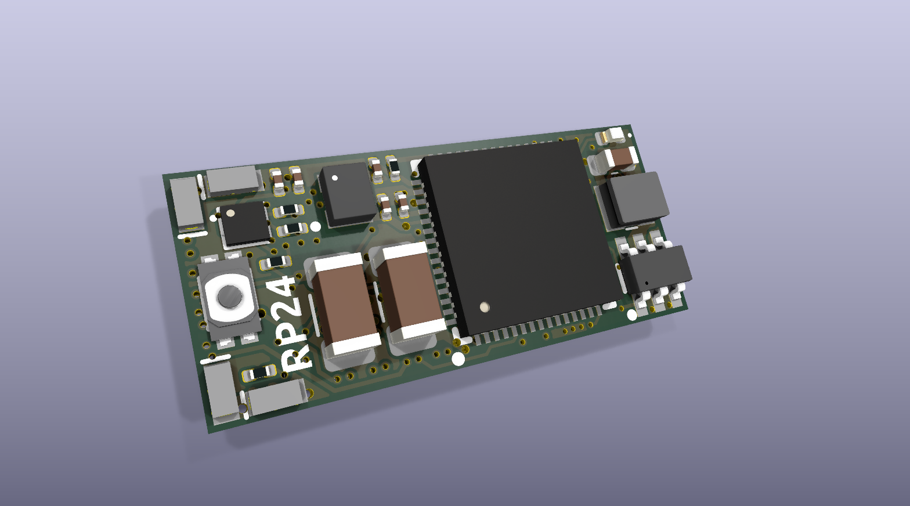
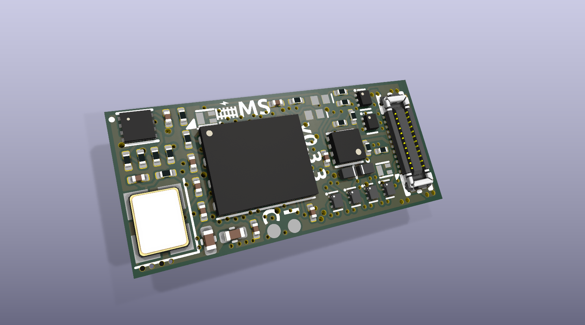
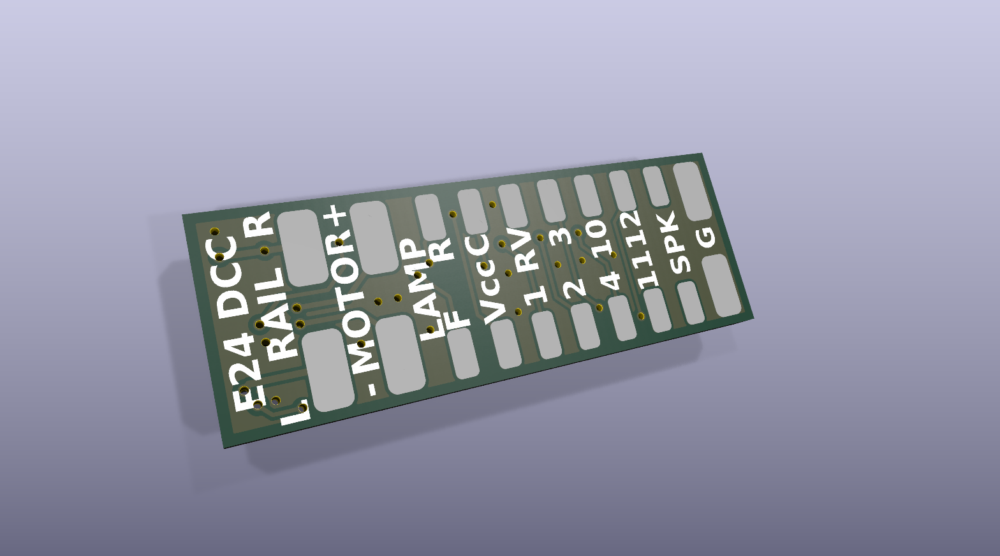

# rp24-dcc-decoder
DIY DCC decoder for model railroad locomotives in an E24 form factor suitable for N scale/gauge locomotives

# Features
- 8x MOSFET-switched functions
- 5x GPIO pins (3.3V input/output)
- Up to 0.75A motor current
- E24 form factor (approx 20mm x 9mm)
- i2s audio speaker output
- 12V nominal rail voltage (16V max)

# USB Programmer/E24 Tester Features
- USB-C port for easy programming and loading sound files
- Onboard LEDs for all aux outputs for simple decoder testing
- Breakout header for most E24 pins, including speaker, motor, rectified rail power, Vcc, plus all five E24 GPIO pins (Aux 3, 4, 10, 11, 12)
- Programming track input header allows for stationary decoder testing and CV programming

# RP24 Decoder Pinout
| E24 Pin | Function | GPIO Pin |
| --- | --- | --- |
| 1 | Speaker+ | USB D+ |
| 2 | Speaker- | USB D- |
| 3 | GND | GND |
| 4-5 | Motor- | N/A |
| 6-7 | Motor+ | N/A |
| 8 | Cap+ | GPIO20 |
| 9 | Lamp Front | GPIO6 (MOSFET) |
| 10 | Lamp Rear | GPIO7 (MOSFET) |
| 11 | AUX1 | GPIO8 (MOSFET) |
| 12 | AUX2 | GPIO5 (MOSFET) |
| 13 | AUX8 | GPIO4 (MOSFET) |
| 14 | AUX7 | GPIO3 (MOSFET) |
| 15 | AUX6 | GPIO9 (MOSFET) |
| 16 | AUX5 | GPIO2 (MOSFET) |
| 17 | U+ | DC Rail Voltage |
| 18 | Vcc | 3.3V |
| 19 | AUX10 | GPIO10 |
| 20 | AUX4 | GPIO13 |
| 21 | AUX3 | GPIO14 |
| 22 | GND | GND |
| 23 | AUX11 | GPIO0 |
| 24 | AUX12 | GPIO1 |
| N/A | Motor Driver A | GPIO25 |
| N/A | Motor Driver B | GPIO26 |
| N/A | Back EMF A | GPIO28 |
| N/A | Back EMF B | GPIO29 |
| N/A | ADC Reference (ADC pin connected to GND)| GPIO27 |
| N/A | DCC signal TTL | GPIO21 |
| N/A | RailCom Out | GPIO11 |
| N/A | Status LED | GPIO19 |
| N/A | i2s DIN | GPIO22 |
| N/A | i2s BCLK | GPIO23 |
| N/A | i2s LRCLK | GPIO24 |
| N/A | Charge external keepalive capacitor (PWM at very low duty cycle only) | GPIO20 |

# Images
## RP2350 Decoder

## RP24 USB Programmer/E24 Decoder Tester

## E24 Receiver/Wire Breakout

Inspired by the rp2040-decoder project by gab-k: https://github.com/gab-k/RP2040-Decoder

## Reference:
### E24
- RCD-124 (German): https://normen.railcommunity.de/RCD-124.pdf
- https://dccwiki.com/Locomotive_Interface/E24
### RailCom
- [NMRA S-9.3.2, Section 2](https://www.nmra.org/sites/default/files/s-9.3.2_2012_12_10.pdf)
- Example RailCom transmitter circuit: [CircuitJS](https://www.falstad.com/circuit/circuitjs.html?ctz=CQAgjCAMB0l3BWcMBMcUHYMGZIA4UA2ATmIxAUgoqoQFMBaMMAKABdkUAWEFbkYoSp8eVJr2h9CKBIS6E8kQrgyRsjPCAYZJM4vgxCU2E90bNecEABM6AMwCGAVwA2bdgMO8MKTj0y+YhDY0GB4XAgmkFwoYAhg0sRaKLrSsvKKypCq6gyaaFS2jq7uAE5+4EIVIlC8KCzlgsI+IHiC3oEgCnAsAEoVzL5gkPxcmlRUXFQh2LUT0Ageg9MIQ2E82Ku1EDDZxG1cU-FywwhJMMwI8iRoMXKr8paF9s5uSyMbW2SEIJudO7AMPtiIc0DIwAVsD9hFYiq8yhU-uAIStOt1ICwAMqtdoBECGfItKgQRwuADOdFq9QA5viFLw8JoCb8oXMWLTmOFfvTOTwphMoCxsKoKvIeMsQGLfmyAO7VfjDfgyaEsOVNXhTARVPEYtXalrfDqCuWK8UQrXE826i2VKjqtDjVU2wZ0zQu63Ml3M5XG6qMxFba2GqGaQ3831hqymyVWa3R8PRpFx9Ysn4Q7C+Ewqk3GTOs9O+KVB81S4jmrMR8us4OsuO5yVyZFoBuiJ3xxtlwuNjHC4kfJsDKqzCZO9UusdVDFAA)

View this project on [CADLAB.io](https://cadlab.io/project/28797). 