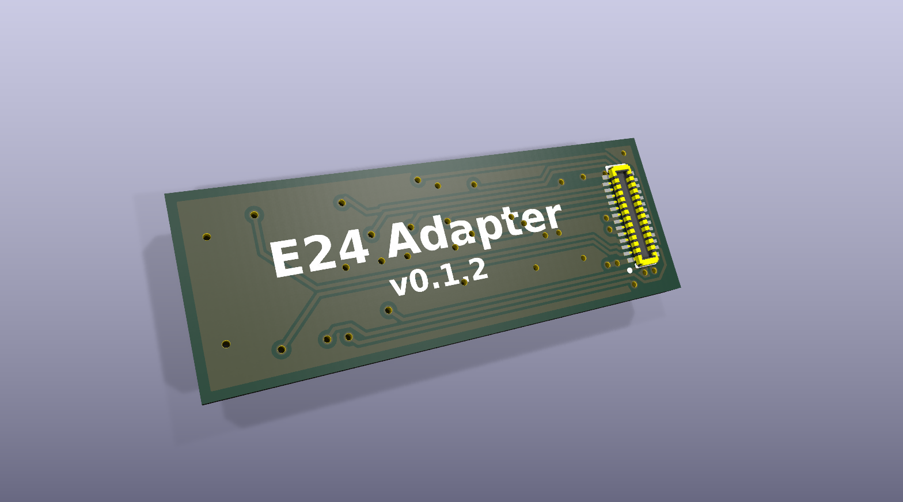

# rp2040-decoder-e24
DIY DCC decoder for model railroad locomotives in an E24 form factor suitable for N scale/gauge locomotives

# Features
- 4x MOSFET-switched functions
- 5x GPIO pins (3.3V input/output)
- Up to 0.75A motor current
- E24 form factor (19.5mm x 8.5mm)
- i2s audio output chip (software support forthcoming)
- 12V nominal rail voltage (16V max)

# USB Programmer/E24 Tester Features
- USB-C port and SWD header for programming/debugging
- Built-in front/rear "lamp" LEDs for decoder testing
- Breakout header for most E24 pins, including speaker, motor, and 9 functions
- Rail contact pads on underside of board allow for testing the decoder as a stationary dummy-loco as well as CV programming on N-gauge track

# E24 Receiver Breakout Board Pinout
| E24 Pin | Function | GPIO Pin |
| --- | --- | --- |
| 1 | Speaker+ | USB D+ |
| 2 | Speaker- | USB D- |
| 3 | GND | GND |
| 4-5 | Motor- | N/A |
| 6-7 | Motor+ | N/A |
| 8 | Cap+ | Not connected |
| 9 | Lamp Front | GPIO26 (MOSFET) |
| 10 | Lamp Rear | GPIO27 (MOSFET) |
| 11 | AUX1 | GPIO24 (MOSFET) |
| 12 | AUX2 | GPIO25 (MOSFET) |
| 13 | AUX8 | Not connected |
| 14 | AUX7 | Not connected |
| 15 | AUX6 | Not connected |
| 16 | AUX5 | Not connected |
| 17 | U+ | DC Rail Voltage |
| 18 | Vcc | 3.3V |
| 19 | AUX10 | GPIO0 |
| 20 | AUX4 | GPIO4 |
| 21 | AUX3 | GPIO3 |
| 22 | GND | GND |
| 23 | AUX11 | GPIO1, SWD |
| 24 | AUX12 | GPIO2, SWCLK |
| N/A | Back EMF A | GPIO29 |
| N/A | Back EMF B | GPIO28 |
| N/A | Rail signal decoder | GPIO21 |
| N/A | Status LED | GPIO12 |
| N/A | i2s LRCLK | GPIO5 |
| N/A | i2s BCLK | GPIO6 |
| N/A | i2s DIN | GPIO7 |

# Images
## RP2040 Decoder E24

## RP2040 Decoder USB Programmer

## E24 Receiver/Wire Breakout

Based on the rp2040-decoder project by gab-k: https://github.com/gab-k/RP2040-Decoder

## Reference:
- RCD-124 (German): https://normen.railcommunity.de/RCD-124.pdf
- https://dccwiki.com/Locomotive_Interface/E24
